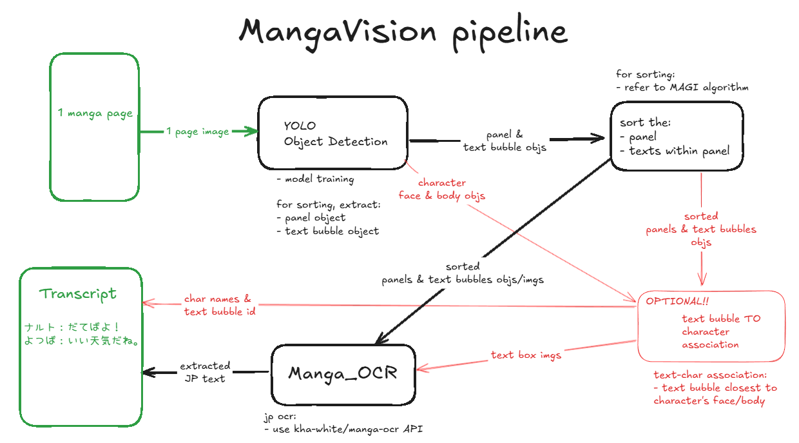

# Senior-Design
Github repository of team **MangaVision** for the CCNY Senior Design II (CSC 59867) course.

## Team Members:
| Name | Role | Github |
|------|------|--------|
| Melchizedek De Castro   | Leader   | [zehdi02](https://github.com/zehdi02)   | 
| Johnson Chen   | Systems Savvy   | [JohnsonChen22002](https://github.com/JohnsonChen22002)   |   
| Mahmud Hasan   | Techsmith   | [QuodFinis](https://github.com/QuodFinis)   |  
| Ayon Kumar Das   | Quality Assurance   | [lastMinuteGuy](https://github.com/lastMinuteGuy)  |

## Documents & Slides
Final Report: [Link](https://docs.google.com/document/d/1D7FpB0Cgo0Z5ozTIefFOsBJ1Wxv8887rcwiHW25GgnQ/edit?usp=sharing)

For a full list of other slides/docx, [click here](slides.md).

## Project Summary:
Japanese comic books called Manga are enjoyed by many all around the world. Manga are made of panels with images in them where the reader would read from right to left in a traditional Japanese way. Their wide variety of genres and stories captures the attention and hearts of many readers. However, there are individuals who aren’t able to enjoy these graphic novels because of visual impairments. 

The MangaVision project aims to make Japanese manga accessible to visually impaired readers by converting visual storytelling into an understandable audio or text-based format. Our approach centers on the development Object Detection and Optical Character Recognition (OCR) based application which allows the reader to input or upload an image of a manga page, and in return receive a generated transcript of all of the speech dialogues in the manga page.

MangaVision represents a significant step toward accessible manga, bridging a gap in accessibility technology for visually impaired users. While the system requires further improvement for comprehensive adoption, our work lays a robust foundation for future advancements in multimodal content accessibility.

## MangaVision Roadmap
Team Planning Builder: [Link](https://docs.google.com/spreadsheets/d/1_CTNEVaTbUeiSTDD4i7zU3mf360-n2xHzTq5874sA4o/edit?gid=246428048#gid=246428048)

## Additional Project Information:
- Input: A single image of a manga page 
- Output: A transcript of sorted speech bubble texts
- OPTIONAL output: a Transcript of sorted speech bubble text, along with the associated character names.

| Dataset | Summary | Element |
|---------|---------|---------|
|Manga109|<li>Provides permission to access 109 manga books legally.</li><li>Provides annotations for character face & body, text boxes, and panel boxes.</li><li>Contains  21,142 pages (2 pages for every image) or 10,602 images</li>|<li>Manga Volumes</li><li>Character faces</li><li>Panel</li><li>Speech/Dialogue</li>|

<!--- |KangaiSet|<li>A dataset to supplement Manga109 dataset for facial expression recognition</li><li>Properly annotated according to character’s face bounding boxes from Manga109</li><li>7 emotions: anger, disgust, fear, happiness, neutral, sadness, surprise.</li><li>Annotates 9,387 facial emotions out of the 118,593 faces annotated in Manga109</li>|<li>Character Facial Expression|
|The Quick, Draw! Dataset|<li>A collection of 50 million drawings across 345 categories, contributed by players of the game Quick, Draw!.</li>|<li>Object Classficifation</li>| --->

| Main Models | Summary | Element |
|---------|---------|---------|
|YOLOv8|<li>Object detection technique used for identification (class recognition) and localization (bounding box) of objects</li><li>Fast and lightweight</li><li>Lower accuracy for smaller objects</li><li>Less precise localization</li><li>May not generalize on complex scene with overlapping objects</li>|<li>Object Detection</li>|

| Comparison Models | Summary | Element |
|---------|---------|---------|
|DETR (DEtection TRansformer) | <li>Streamlines object detection by removing anchor boxes and non-maximal suppression</li><li>Uses transformer encoder-decoder architecture for object detection tasks</li><li>Eliminates traditional object detection mechanisms (like region proposals or anchor boxes)</li><li>Achieves accuracy and performance comparable to Faster R-CNN</li> | <li>Object Detection</li> <li>Decided to abandon the DETR model due to its slow convergence rate and taking a long time to train. We'll be sticking to our initial object detection model choice of YOLOv8.</li>|
|SSD300-fork (Single Shot Multibox Detector)| <li>Employs default boxes (anchors) at multiple scales for multi-scale detection.</li><li>Leverages convolutional layers to predict both bounding boxes and class probabilities.</li><li>Suitable for real-time detection tasks, particularly when computational resources are limited.</li> | <li>Object Detection</li>|

| Technique | Summary | Element |
|---------|---------|---------|
|Manga_OCR ([kha-white](https://github.com/kha-white/manga-ocr))|<li>Specialized OCR for Japanese manga text using a custom Vision Encoder Decoder model.</li><li>Handles vertical, horizontal text, furigana, diverse fonts, and low-quality images.</li><li>Processes multi-line text in a single pass, ideal for manga bubbles.</li><li>Also works for general Japanese printed text (e.g., novels, games).</li>|<li>Text Extraction</li>|

Finalized Goals:
1) [x] Object Detection:
    - [x] Character Face and Body
    - [x] Panels
    - [x] Text Bubbles
2) [x] Sorting:
    - [x] All Panels in a Single Page
    - [x] All Text Bubbles in a Single Panel
3) [x] Japanese text OCR
    - [ ] Text to Character Association (OPTIONAL)
4) [x] Transcript of correctly sorted texts

<!--- # Implementation Goals:
1) Event Drawing Recognizer (Main feature)
- [x] Detect the panel frames on a page
- [x] Detect the text boxes on a page
- [x] Detect character faces/bodies on a page
- [ ] Detect objects in a panel
- [ ] Recognize character facial expressions
- [ ] Recognize character names 
- [ ] Associate dialogues to the correct speaker
- [ ] Establish panels’ correct reading order
- [ ] Caption/Description generation for the panel as a whole
2) Text-To-Speech (Additional Optional Feature)
- [ ] Translate extracted speech bubbles texts to audio                                    
3) JP to EN Translation (Additional Optional Feature)
- [ ] Manga109 dataset is in JP. we need to translate them to EN.
--->

# MangaVision Pipeline

# Challenges:
- Developing zero-shot face recognition model
- Associating dialogues to the correct speaker
- Establishing panels’ correct reading order
- Caption/Description generation for the panel as a whole
- In Yolov8, we want to augment our data to match real life scenarios better
- Long runtime training data for Mangavision
- Model sometimes detects a single object multiple times (overlapping)
- Different certain manga styles make it harder to detect panels and text boxes

## Resources Exploration (Ideas Collection):
Ideas that we've found and researched: [click here](ideas.md).

<!-- ARCHIVED
# Features Summary/Design:
A) Manga Panel Drawing/Event Teller - Drawing recognizer:
1. To describe the drawings on each manga panel as an event (must follow manga reading convention of top-right to bottom-left)
2. Such events could be facial expressions, recognizing the subject/character and call their names, actions/verbs being done by a subject, settings or scenes
3. The event would then be transcribed and spoken to the reader through a Text-To-Speech program

B) Simple Text-To-Speech:
1. A button that the reader activates to start reading the manga for them
2. Describing drawings and what’s happening in it in order (top to bottom, right to left)
3. Reads the speech bubbles in order (top to bottom, right to left)

C) Plot Summarizer:
1. A button that allows the reader to summarize the current manga chapter
2. Once the button is pressed, extract all of the text embedded in the speech bubbles using OCR or other text extractor tools
3. Visual events must also be taken into account using our Drawing Recognizer (A)
4. Collect and transcribe every speech and event
5. Put the collection of speech and events in a plot summarizer model
7. The output from the model is then read aloud to the reader with TTS (0)

D) Language Translator:
1. A button that can toggle the current manga chapter into English or to its original language
2. Once the button is pressed, do the same thing as at (B) steps 2-3. (step 3 would already be in english since there would be no original language texts, just images)
3. Collect and transcribe every speech and event in the manga chapter
4. Translate the text from whatever native language it was to English
5. Replace the original text with the translated text while still allowing toggle language swap function

0) Text Extractor
1. With Mokuro, speech bubble detection has already been done for us
2. We just need to extract all the text in the speech bubbles in order (top to bottom, right to left).
3. Perhaps put the extracted text in a separate text file which can be fed onto our Plot Summarizer and Translator models.

